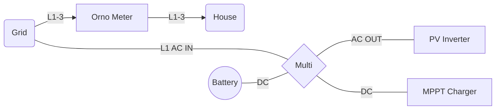

# dbus-orno-meter Service

## Installation

1. Copy all files to the /data/etc/ folder on your venus:

   - /data/etc/dbus-orno-meter

2. Set permissions for files:

   `chmod 755 /data/etc/dbus-orno-meter/service/run`

   `chmod 744 /data/etc/dbus-orno-meter/kill_me.sh`

3. Add a symlink to the file /data/rc.local:

   `ln -s /data/etc/dbus-orno-meter/service /service/dbus-orno-meter`

   If you are using other services like `dbus-serialbattery` make sure the installation script has not override the `rc.local`.

## Wiring diagram
The orno meter must placed befor your home consumption, because it can not decide between feedin and consumption. The Multi must be connected before the orno meter. When you use a PV inverter it must be connected to AC Out of the Multi, please take care of the [Factor 1.0 rule](https://www.victronenergy.com/live/ac_coupling:start). (At the moment only a single phase mutli system is supported, may i add 3 phase support soon.)



## Configuration
I use a simply modbus to modbus tcp gateway [mbusd](https://github.com/3cky/mbusd) on a raspberry pi to get the orno to the LAN. Here you can simply edit the IP/Port/Unit-ID in the `dbus-orno-meter.py`.
```    
# Here you must set your orno Modbus settings!
self._modbus = ModbusClient(host='192.168.0.212', port=501, auto_open=True, unit_id=2, debug=True)
```

Tell the right vebus path! Use `dbus-spy` to get your vebus path, and edit the following line in `dbus-orno-meter.py`. 
```
AcActiveInL1Power = bus.get_object('com.victronenergy.vebus.ttyUSB2', '/Ac/ActiveIn/L1/P').GetValue()
```

## Inspiration by 
- https://github.com/RalfZim/venus.dbus-fronius-smartmeter
- https://github.com/victronenergy/velib_python
- https://github.com/victronenergy/dbus-smappee
- https://github.com/fabian-lauer/dbus-shelly-3em-smartmeter
- https://github.com/Louisvdw/dbus-serialbattery
